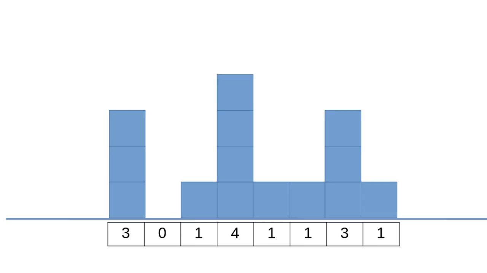

# assignment

### Question 1:
If citations are arranged in descending order then 
If the number of elements occurring before the current element is greater than or equal to the value current element, then current element is the h-index of author under consideration.

### Question 2
Water will be trapped only if there is atleast one block on either side of any depression. 
This problem could be translated to the problem of counting zeroes. We have to count zeroes lying between two non-zero integers and sequentially remove the last layer of elevation graph.

